# Proyecto: Servidor Web en Java con Framework 

## Descripción
Este proyecto consiste en la implementación de un servidor web simple en Java que soporta la entrega de páginas HTML e imágenes PNG, javascript. Además, proporciona un mini framework que permite la construcción de aplicaciones web a partir de POJOs utilizando anotaciones personalizadas similares a Spring Boot. Ademas permite solicitudes concurrentes y se encuentra desplegado en la nube aws

El servidor soporta peticiones GET y permite definir controladores con rutas personalizadas mediante las anotaciones `@RestController`, `@GetMapping` y `@RequestParam`.

## Características Principales
- Servidor HTTP que escucha en el puerto 35000.
- Capacidad para manejar rutas dinámicas con anotaciones.
- Soporte para `@RestController` y `@GetMapping` para definir controladores.
- Soporte para `@RequestParam` para recibir parámetros en las peticiones GET.
- Descubrimiento automático de controladores en el paquete `org.example.controller`.
- Capacidad para manejar solicitudes concurrentes.

## Requisitos
Para ejecutar este proyecto, asegúrate de tener instalados los siguientes componentes:
- **Java 21** (o compatible con tu entorno).
- **Maven** (para la gestión de dependencias y compilación del proyecto).

## Estructura del Proyecto
```
|-- src/main/java/org/example
|   |-- annotations/   # Anotaciones personalizadas (@RestController, @GetMapping, @RequestParam)
|   |-- controller/    # Controladores de ejemplo
|   |-- server/        # Implementación del servidor y manejador de rutas
|-- pom.xml           # Archivo de configuración de Maven
```

## Instalación y Ejecución
### 1. Clonar el Repositorio
```sh
$ git clone https://github.com/lilP0x/Areplab4
```

### 2. Compilar el Proyecto
```sh
$ mvn clean package
```

### 3. Ejecutar el Servidor
```sh
$ java -cp target/classes org.example.server.HttpServer
```
El servidor quedará escuchando en el puerto **35000**.

### 4. Probar Endpoints
#### Saludo Simple:
```sh
http://localhost:35000/app/hi?name=Juan
```
**Respuesta:**
```
Hola Juan
```

#### Suma de Dos Valores:
```sh
http://localhost:35000/app/add?value=5&value2=3
```
**Respuesta:**
```
8
```

#### Resta de Dos Valores:
```sh
http://localhost:35000/app/sub?value=10&value2=4
```
**Respuesta:**
```
6
```
## Diagrama de clases 

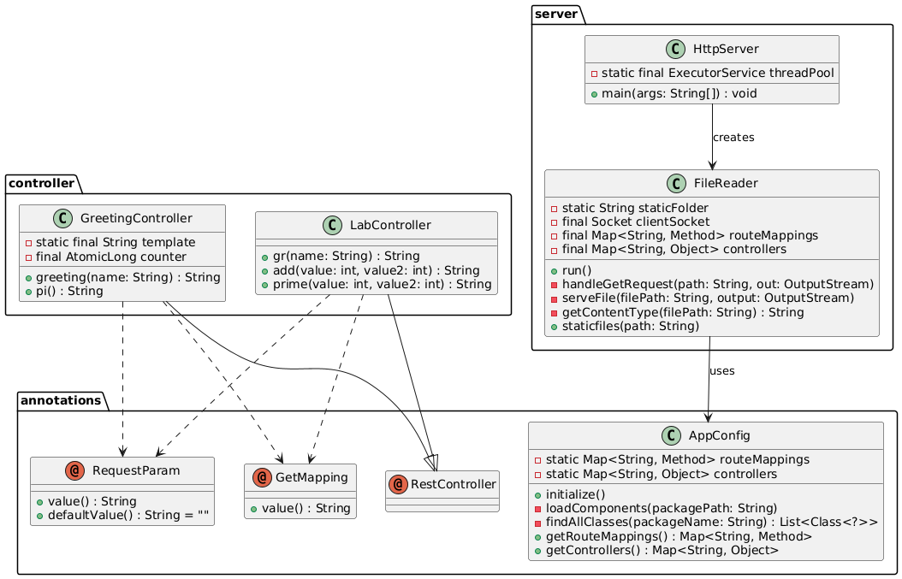

# **Descripción del Diagrama de Clases**

Este diagrama representa la estructura y relaciones de las clases principales en un framework minimalista para manejar solicitudes HTTP basado en anotaciones personalizadas en Java.

---

## **1. Paquete `org.example.annotations` (Anotaciones Personalizadas)**
Este paquete define anotaciones utilizadas para marcar clases y métodos en el framework:

- **`@RestController`** → Indica que una clase es un controlador de endpoints HTTP.
- **`@GetMapping`** → Marca métodos que manejan solicitudes `GET`, con un atributo `value()` que define la ruta.
- **`@RequestParam`** → Se usa para extraer parámetros de una solicitud HTTP, con un atributo `defaultValue()` para valores por defecto.

---

## **2. Paquete `org.example.controller` (Controladores de la Aplicación)**
Contiene las clases que exponen endpoints HTTP.

### **Clase `GreetingController`**
- Define dos endpoints:
  - `/app/greeting` → Retorna un saludo con el nombre recibido como parámetro.
  - `/app/pi` → Retorna el valor de π.

### **Clase `LabController`**
- Define tres endpoints para realizar operaciones con parámetros:
  - `/app/hi` → Saludo personalizado.
  - `/app/add` → Suma dos valores enteros.
  - `/app/sub` → Resta dos valores enteros.

Ambas clases extienden la funcionalidad de `@RestController`, y sus métodos están anotados con `@GetMapping` y `@RequestParam`.

---

## **3. Paquete `org.example.config` (Configuración de la Aplicación)**

### **Clase `AppConfig`**
- Se encarga de la inicialización y carga dinámica de controladores.
- Mantiene mapas de controladores y rutas en `routeMappings` y `controllers`.
- Sus métodos principales son:
  - `initialize()` → Inicializa la aplicación.
  - `loadComponents()` → Escanea un paquete en busca de clases con `@RestController`.
  - `findAllClasses()` → Encuentra todas las clases de un paquete.

Esta clase permite el registro automático de rutas sin necesidad de configurarlas manualmente.

---

## **4. Paquete `org.example.server` (Servidor HTTP y Manejo de Archivos)**

### **Clase `FileReader`**
- Atiende solicitudes HTTP en hilos separados.
- Identifica si una solicitud es para un archivo estático o un endpoint.
- Métodos clave:
  - `handleGetRequest()` → Procesa rutas registradas en `AppConfig`.
  - `serveFile()` → Sirve archivos estáticos.
  - `getContentType()` → Devuelve el tipo MIME del archivo solicitado.

### **Clase `HttpServer`**
- Inicia un servidor en el puerto `35000`.
- Usa un `ThreadPool` para manejar múltiples conexiones concurrentes.
- Llama a `AppConfig.initialize()` al inicio para registrar controladores automáticamente.

---

## **Relaciones Clave en el Diagrama**
1. **Los controladores (`GreetingController` y `LabController`) dependen de las anotaciones `@RestController`, `@GetMapping` y `@RequestParam`.**
2. **`AppConfig` actúa como intermediario entre los controladores y el servidor HTTP, administrando los mappings de rutas.**
3. **`FileReader` y `HttpServer` trabajan juntos para atender solicitudes, usando `AppConfig` para encontrar los métodos correctos a ejecutar.**

Este diseño sigue el patrón **"Inversión de Control"**, ya que la detección de controladores y métodos no se realiza manualmente, sino que el framework los detecta dinámicamente con **reflexión en tiempo de ejecución**.

---

## Adaptacion para la concurrencia

Como requerimiento funcional se requiere que el servidor reciba peticiones de manera concurrente. Esto lo lograremos mediante la creacion de hilos hasta un maximo de 10. 

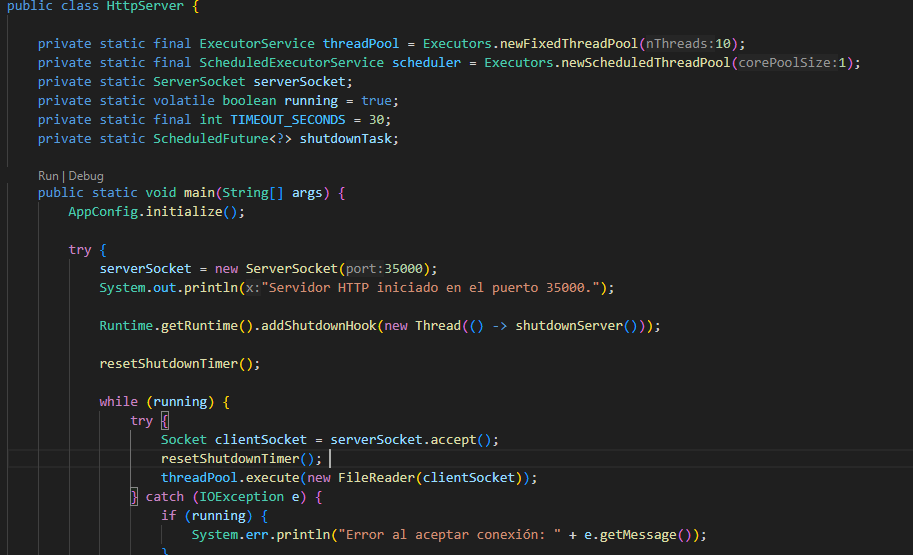

Aqui se ve como existe un pool de hilos de un maximo de 10.

## Apagado elegante. 

Como siguiente requerimiento funcional se pidio que el servidor se apagara de una manera elegante y para esto se implemento el siguiente codigo.

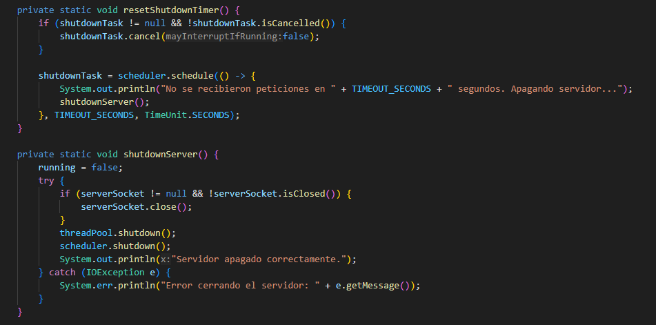

Esto crea un timer que si el servidor no recibe una peticion en un rango de 30 segundos entonces crea un hilo que apaga el servidor. Si llega una peticion durante ese tiempo el timer es reiniciado.

## Combios adicionales

Como cambio adicional para mantener los mas altos estandares de calidad y extensibilidad del codigo fue implementada una nueva clase para que sea responsable de cargar las anotaciones. Esto aumenta la escalabilidad del servidor y delega funcionalidades para disminuir el acoplamiento. Esta clase es  `AppConfig`. 

Esta clase cargara todas las anotaciones por si misma recien el servidor es ejecutado. Y el servidor accedera de manera estatica a los hashmap que contienen los endpoints para asi dar respuesta a las peticiones.

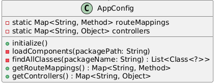

## Ahora veremos el despliegue en la nube AWS

Primero fue necesario la creacion de las imagenes docker por medio del uso del dockerfile y dockercompose. 

### Docker

Es asi como crearemos el docker file siguiendo el ejemplo propuesto.

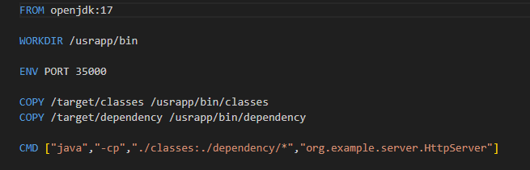

Ahora crearemos la imagen docker. Para esto tendremos que iniciar docker desktop. y posteriormente tendremos que ejecutar el siguiente comando:

```sh
docker build --tag dockersparkprimer .
```

Ahora tendremos que poner a correr las imagenes y asignarles un puerto por el que escucharan y por el que lo mapearan para el servidor interno usando el siguiente comando:

```sh
docker run -d -p 34000:6000 --name firstdockercontainer dockersparkprimer
```

Podremos revisarlas usando el siguiente comando:


```sh
docker images
```

y ver en que estado estan con el siguiente comando:

```sh
docker ps
```

Deberia ver algo asi:
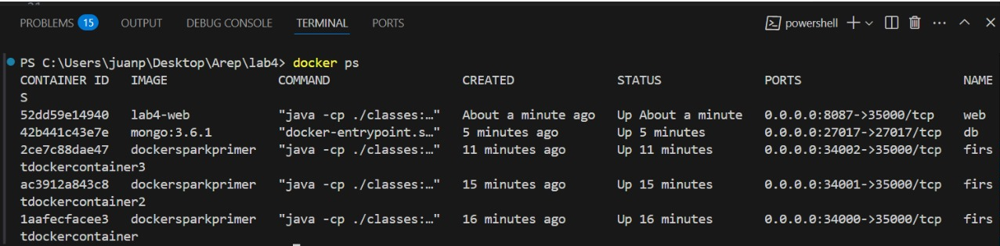

Despues lo probaremos y deberia aparecer algo asi:

### Test 1
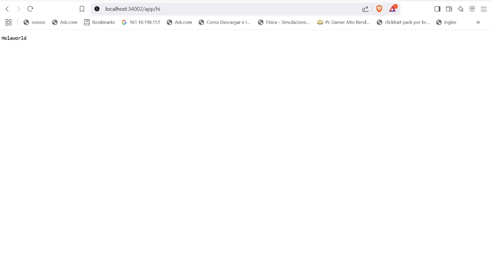

### Test 2

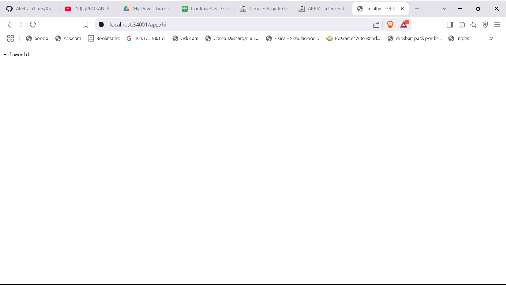

### Test 3


Ahora usando JUnit usaremos test automatizados.

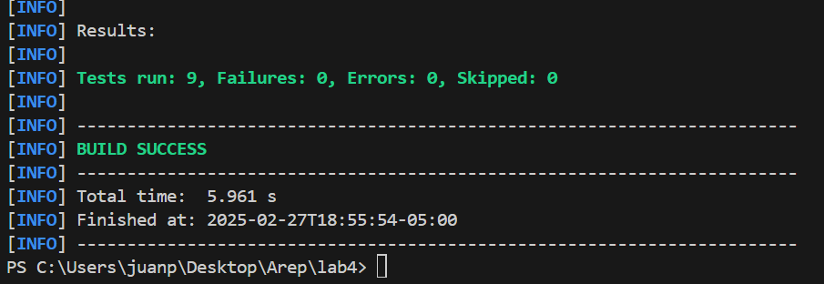

Clase test

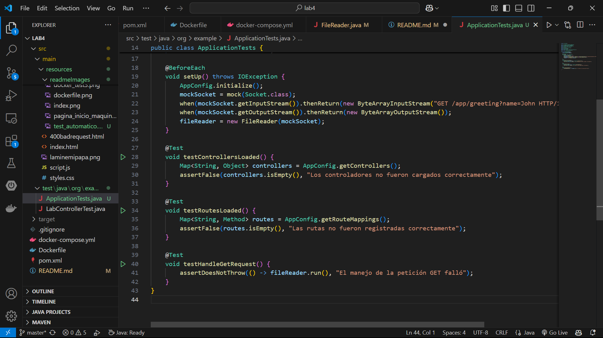


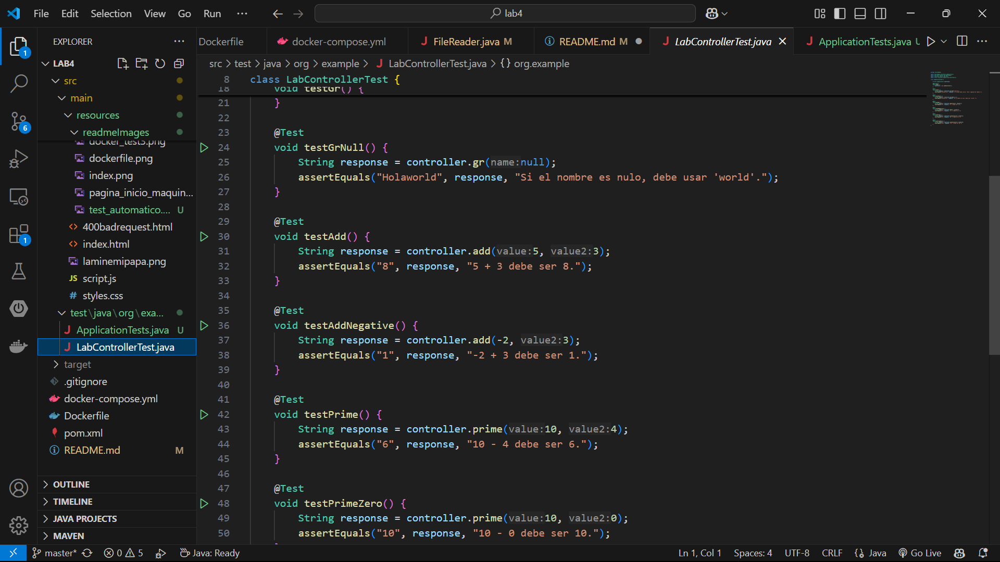
### Docker Compose

Ahora por medio del docker compose generaremos una una configuración docker, por ejemplo un container y una instancia a de mongo en otro container. Cree en la raíz de su directorio el archivo docker-compose.yml con le siguiente contenido:

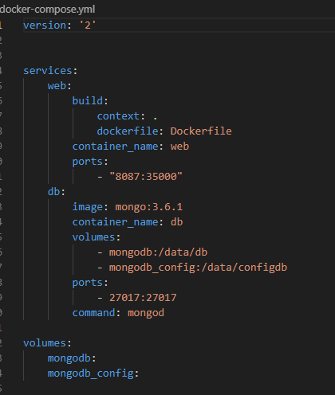

Ahora para ejecutarlo debera colocar el siguiente comando.

```sh
docker-compose up -d
```

nuevamente para verificar ejecute


```sh
docker ps
```

Deberia ver algo asi:

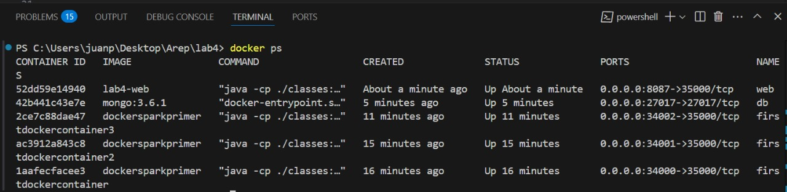

Ahora estamos listos para poder desplegar en AWS.

Para eso primero tendremos que subir las imagenes docker a un repositorio en dockerhub. Para esto usare el siguiente comando (Despues de haberse logeado):

```sh
docker push juanito152612/labarep:latest
```
Deberia ver algo asi en su repositorio.

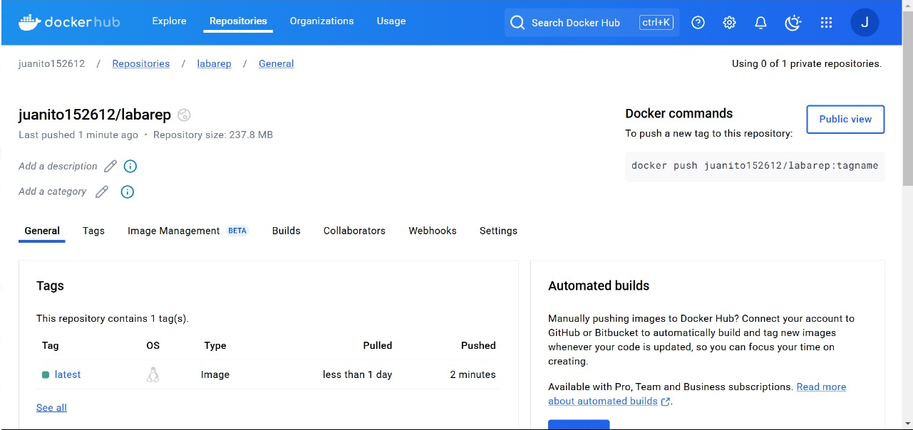

Ahora por medio de una maquina virtual de AWS iniciaremos mediante SSH. Al inciar veremos algo asi:

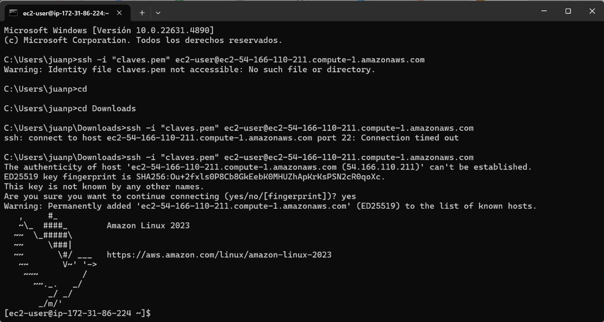

Ahora tendremos que actulizar el sistema operativo y descargar docker respectivamente. Colocado los siguientes comandos:

```sh
sudo yum update -
```

```sh
sudo yum install docker
```

Ahora tendremos que iniciar el servidor docker:

```sh
sudo service docker start
```
Ahora tendremos que configurr el usuario con el siguiente comando.

```sh
sudo usermod -a -G docker ec2-user
```

Posteriormente tendremos que salir de la maquina y volver a entrar para que los grupos de usuarios tenga efecto.

Por ultimo tendremos que crear una instancia de la imagen docker alojada en dockerhub usando el siguiente comando.
```sh
docker run -d -p 42000:35000 --name firstdockerimageaws juanito152612/labarep
```
Esto jalara la imagen docker alojada en dockerhub y la pondra a correr por los puertos indicados.

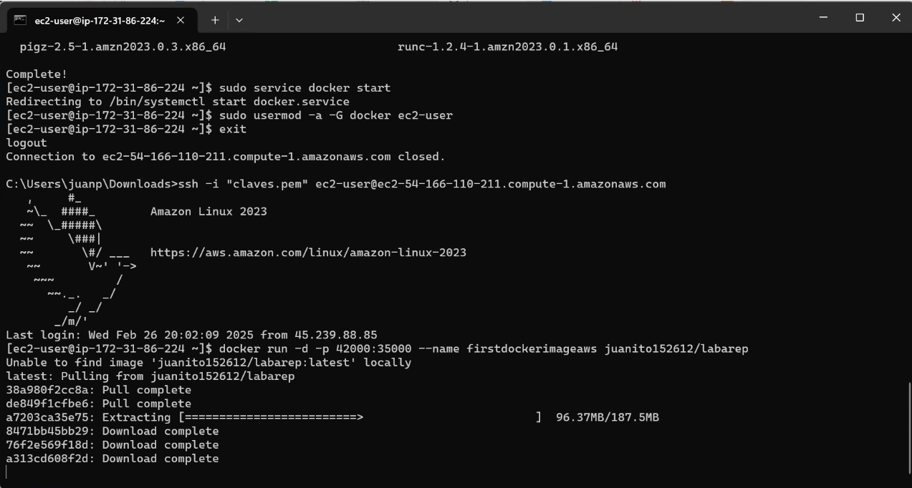

Por ultimo tendremos que abrir los puertos de seguridad en la maquina virtual AWS. Y ahora probaremos usando la url que se nos entrego al crear la maquina virtual.


